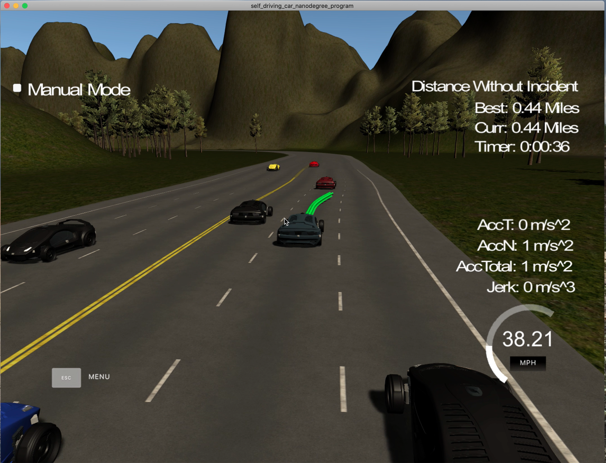
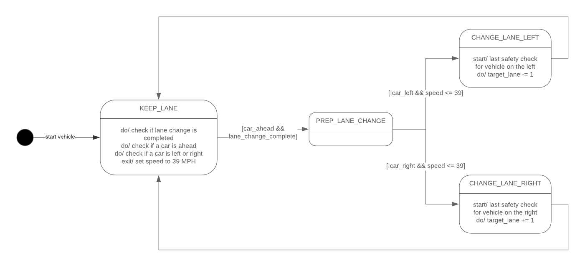
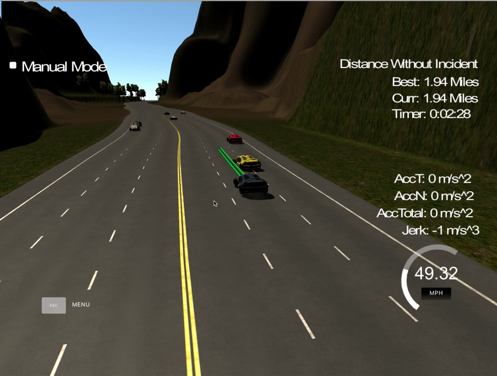

# Project 6 - Highway Driving

This project from Udacity‘s Self-Driving Car Engineer Nanodegree program implements a approach to highway driving in C++ for self-driving cars. The project covers the implementation of a path planning algorithm for driving on a highway, lane changing, usage of Frenet coordinates, state machine and testing in a simulator.

----

## 1 - Project Overview

### Goals:

* safely navigate around a virtual highway with other traffic 
* keep as close as possible to the speed limit 50 MPH
* keep inside the lane unless when changing lanes
* avoid hitting other cars
* switch lanes, if the car is slower infront of the ego vehicle
* use smooth lane change trajectories (max. acceleration 10m/s^2 and max. jerk 10m/s^3)
* complete the 6946m high in a little over 5 minutes

### Structure:

The project is divided into different files.

* `src/main.cpp`: the routine with connection to the simulator
* `src/vehicle.cpp` (and header file): the path planning algorithm
* `src/trajectory_gen.cpp` (and header file): the trajectory generator
* `src/Eigen-3.3`: Eigen library
* `src/spline.h`: usefull header file for spline fitting (original can be found [here](http://kluge.in-chemnitz.de/opensource/spline/))
* other helper, build and installation files

### Dependencies

This project needs following dependencies:

* cmake >= 3.5
* make >= 4.1
* gcc/g++ >= 5.4
* [uWebSockets](https://github.com/uWebSockets/uWebSockets)
  * Run either `install-mac.sh` or `install-ubuntu.sh`.

To display the results the simulator from Udacity is needed. It can be downloaded [here](https://github.com/udacity/self-driving-car-sim/releases/tag/T3_v1.2). 
To run the simulator on Mac/Linux, first make the binary file executable with the following command:

```shell
sudo chmod u+x {simulator_file_name}
```

### Basic Build Instructions

1. Clone this repo.
2. Make a build directory: `mkdir build && cd build`
3. Compile: `cmake .. && make`
4. Run it: `./path_planning`.

---

## 2 - Rubic Points

Here I will consider the [rubric points](https://review.udacity.com/#!/rubrics/1971/view) individually and describe how I addressed each point in my implementation.

#### 2.1 - Compilation

**1.) The code compiles correctly.**

I tested the code with the given `CMakeLists.txt` and `cmakepath.txt` files and it compiled with no errors.

#### 2.2 - Valid Trajectories

**1.) The car is able to drive at least 4.32 miles without incident.**

To verify I tested the code about 2 hours with no incidents. How I adressed every possibile incident I will explain below.

**2.) The car drives according to the speed limit.**

Since there are some inaccuracies I set the maximal speed to 49.5 MPH. If there is no vehicle ahead the trajectory 	generator gets this maximal speed as target velocity (s. lines 63-69; `vehicle.cpp`). To reach this velocity the trajectory generator calculates according to the maximal acceleration the increment of velocity and uses this to calculate the spacing of the trajectory points (lines 133-145, `trajectory_gen.cpp`):

```c++
// Handle speed
if (current.speed < target_speed) {
	double vel_inc = REFRESH_RATE * 0.5 * MAX_ACC / MILES_TO_METERS;
	current.speed = current.speed + vel_inc;
} else if (current.speed > target_speed) {
	double vel_inc = REFRESH_RATE*MAX_ACC / MILES_TO_METERS;
	current.speed = current.speed - vel_inc;
}

// Split spline into points
double delta = distance_target / (REFRESH_RATE*(current.speed*MILES_TO_METERS));
current_x += x_target/delta;
double current_y = spline(current_x);
```

For more details on the trajectory generation see point 2.3.

**3.) Max Acceleration and Jerk are not Exceeded.**

The longitudinal acceleration is covered by adding it into the velocity increase calculation as shown above (MAX_ACC = 9.5). To keep the lateral acceleration under the threshold I reduced the velocity when changing lanes to about 39 MPH. By doing this, I also made sure, the jerk is not exceeded. 

**4.) Car does not have collisions.**

To check if there are cars ahead or next to the ego vehicle I used the sensorfusion data. First I check for each car in the sensorfusion data, if it is ahead and within the safety distance. The distance is calculated by the two second rule (car velocity times two). Because of the car ahead the target velocity must be set to the current velocity of the car to avoid a collision. This is implemented in lines 75-87 in `vehicle.cpp`:

```c++
// Check for car ahead
vector<double> car = sensor_data[i];
int car_lane = round((car[6]-2.0)/4.0);
double car_velocity = sqrt(car[3]*car[3] + car[4]*car[4]);
if (car_lane == this->lane && car[5] > this->s) {
	double distance_to_ego = distance(this->x, this->y, car[1], car[2]);
  double security_distance = car_velocity*2;
  if (distance_to_ego < security_distance) {
    std::cout << "Vehicle upfront... Slow down! v=" << car_velocity/MILES_TO_METERS 
      << std::endl;
    target_vel = car_velocity/MILES_TO_METERS;
    vehicle_ahead = true;
  }
}
```

To check, if there is a car next to the ego vehicle I used its Frenet coordinates and compared it to the Frenet coordinates of the ego vehicle (lines 89-98, `vehicle.cpp`):

```c++
// Check if car is left or right
// Using a smaller distance for vehicles behind the ego vehicle, because the ego vehicle is going to speed up after lane changing
bool car_behind = car[5] < this->s;
if ((!car_behind && abs(car[5] - this->s) <= 35) || (car_behind && abs(car[5] - this->s) <= 15)) {
  if (car_lane == (this->lane - 1)) { // left
    vehicle_left = true;
  } else if (car_lane == (this->lane + 1)) { // right
    vehicle_right = true;
  }
}
```

An example how this would look like is shown in the next image:



**5.) The car stays in its lane, except for the time between changing lanes.**

This is achieved by using the Frenet coordinates (especially the d value) in the trajectory generation process.

**6.) The car is able to change lanes.**

If there is a slower vehicle infront of the ego vehicle, it should change lanes. This process is realized by a state machine with the following states (UML state diagram): 



In the state KEEP_LANE the state machine checks if there is a need to change the lane (if there is a slower vehicle upfront) and if the car is not already changing the lane. If this is correct the state machine will switch into the PREP_LANE_CHANGE. Here it checks if there is no car in the other lines and the maximal velocity of 39 MPH for lane changes is given. Then it changes to either CHANGE_LANE_LEFT or CHANGE_LANE_RIGHT where the target lane is set for the trajectory generator. This logic is implemented in lines 102-141 in `vehicle.cpp`.

#### 2.3 - Reflection

**1.) There is a reflection on how to generate paths.**

To produce good trajectories I used the `spline.h` header file by Tino Kluge. This file includes spline fitting for multiple points. For smooth trajectory generation I used the last two points from the previous trajectory. If this trajectory is to short then the current position and the prior position calculated by the yaw. Then three other position calculated by Frenet coordinate s and and a spacing of 30 are added to the spline. These three positions use the d value of the desired target lane. 
Before fitting the spline the points have to be converted into the vehicle coordinate system. 
The spline is a function y(x) and calculates the y for a given x (cartesian coordinate system). The spline is calculated for 30 length units. According to the velocity the spacing between the two points is calculated (see code at 2.2.2). These points are converted back into world coordinates and build the trajectory. 

The spline fitting produces trajectories smooth enough for this project and a constant velocity of about 40 MPH. But for problems in reality the polynomial fitting with jerk optimization would be more suitable. Since this is harder to implement and not necessary for this project, I omited it.

---

## 3 - Reflection

There are some things listed below, that can be improved:

1. The already mentioned jerk minimizing trajectories would allow some more freedom at choosing velocities and trajectory design.
2. The lanes can be chosen by their current velocity to always choose the best lane for advancing.
3. There could be some situations where the code can react not fast enough to prevent a collision (s. image below). To adress this issue it is possible to implement some sort of safety break procedure. This would include exeeding the maximal jerk, which is the reason why it is not implemented in this project.
4. When a car is slower than the ego vehicle and the ego vehicle can not change the lane the ego vehicle slowes down to avoid a collision. This results in going below the security distance. It would be possible to include some code to recover this distance for better safety.



